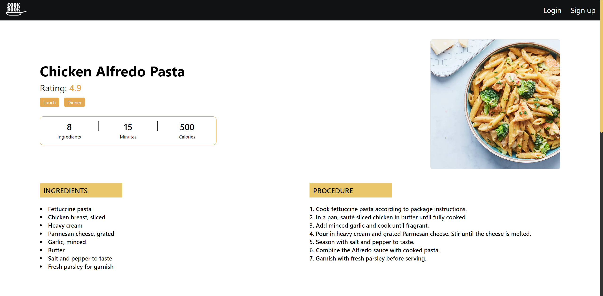
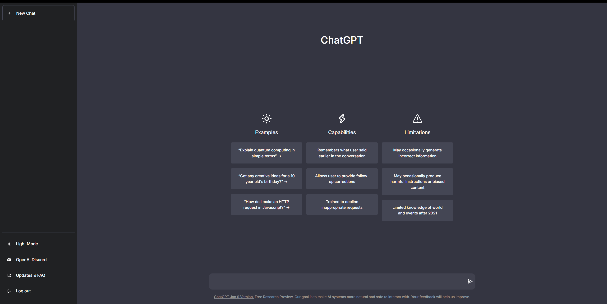
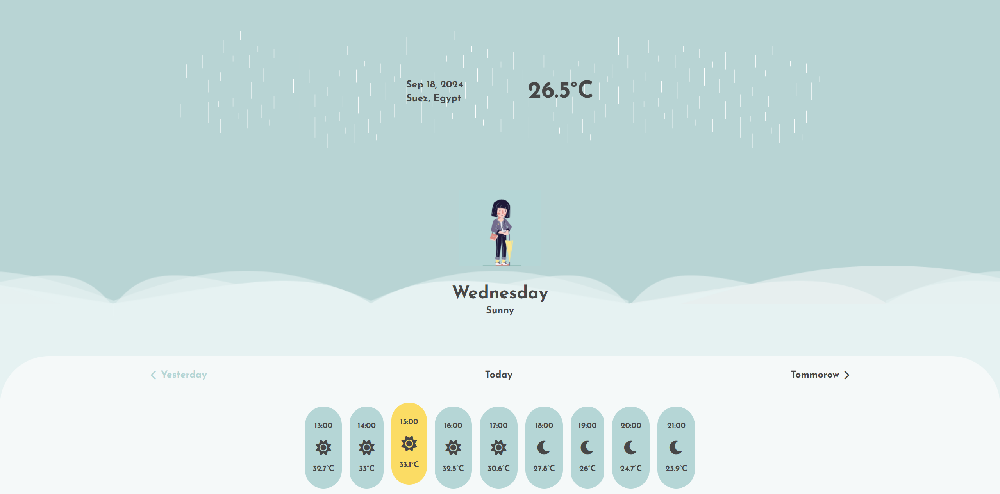

# API-Based Projects 🌐

Welcome to the **API-Based Projects** repository! 🚀 This repository showcases a collection of projects that leverage APIs to provide dynamic functionality and real-time data integration. Each project demonstrates different aspects of working with APIs, from fetching and displaying data to integrating third-party services.

## Overview 📚

In this repository, you'll find various projects that utilize APIs for different purposes, such as fetching data, interacting with external services, and more. Explore these projects to see how APIs can be used to enhance web applications and services.

## Projects 🚀

### [Recipe Finder](https://github.com/ahmedkamal14/Recipe-Finder) 🍲
A recipe search application that uses a recipe API to fetch and display recipes based on user queries. Includes features like search filters and recipe details.

- **[Live Preview](https://ahmedkamal14.github.io/Recipe-Finder)**
- **[Repository](https://github.com/ahmedkamal14/Recipe-Finder)**

---

### [ChatGPT Clone](https://github.com/ahmedkamal14/ChatGptClone) 🤖
A project that simulates the functionality of ChatGPT using OpenAI's API. This application demonstrates how to integrate conversational AI into a web application for interactive user experiences.

- **[Live Preview](https://ahmedkamal14.github.io/ChatGptClone)**
- **[Repository](https://github.com/ahmedkamal14/ChatGptClone)**

---

### [Weather App](https://github.com/ahmedkamal14/WeatherApp) 🌦️
A weather application that fetches and displays real-time weather data from a public API. Features include current weather conditions, forecasts, and location-based updates. Please note that this project is not fully responsive.

- **[Live Preview](https://ahmedkamal14.github.io/WeatherApp)**
- **[Repository](https://github.com/ahmedkamal14/WeatherApp)**

---

## Features 🌟

- **Dynamic Data**: Fetches and displays data from various APIs. 🌐
- **Real-Time Updates**: Provides real-time data and updates. ⏱️
- **Integration**: Demonstrates integration with third-party APIs. 🔗

## Technologies Used 💻

- **Vite** 
- **Tailwind CSS** 
- **JavaScript** 
- **React** 
- **Axios** 

## Libraries & Tools 🛠️

For development, I used several React hooks and libraries to enhance the functionality and maintainability of the codebase:

- **React Router DOM** 
- **React Icons** 
- **React Spinner** 
- **React Use** 
- **useLocalStorage** for managing cart state in local storage.

## Getting Started 🏁

To explore any of the projects, click on the **Live Preview** links to see them in action, or visit the **Repository** links to view the code.

## License 📜

This project is licensed under the [MIT License](https://opensource.org/licenses/MIT). See the [LICENSE](LICENSE) file for details.
